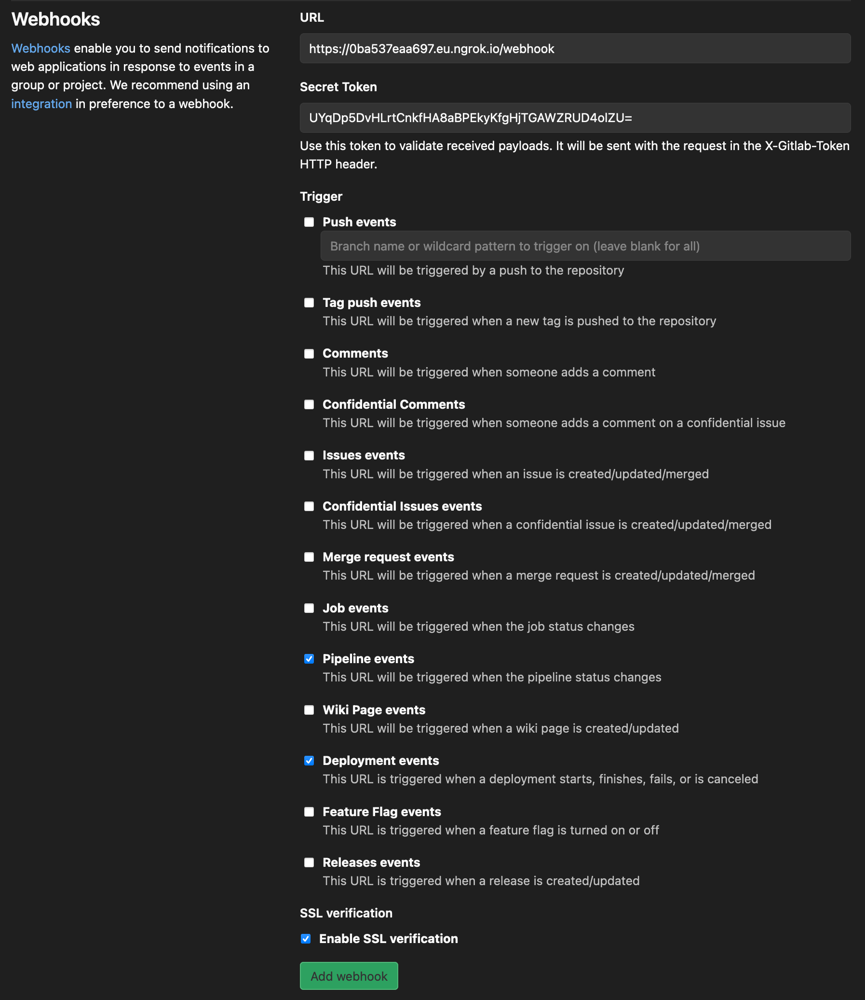

# Example usage of gitlab-ci-pipelines-exporter leveraging pipelines and jobs webhooks

This is a more advanced setup for users looking to reduce the amount of requests being made onto your GitLab API endpoint.

## Requirements

- A personal access token on [gitlab.com](https://docs.gitlab.com/ee/user/profile/personal_access_tokens.html) (or your own instance) with `read_repository` scope
- [git](https://git-scm.com/) & [docker-compose](https://docs.docker.com/compose/)
- GitLab [webhook configuration](https://docs.gitlab.com/ee/user/project/integrations/webhooks.html) privileges/capabilities on group(s) or project(s) you want to monitor.
- For this use case, we will need network connectivity from the GitLab rails processes towards the exporter's http endpoint. I assume that you will want to try this out for your laptop but don't worry, it should still be able to work effortlessly thanks to [Hashicorp Waypoint](https://www.waypointproject.io/)!

/!\ This implementation is for test/example only as it is not recommended to leverage **waypoint.run** endpoints for production purposes.

## 🚀

### Configure and start the exporter

```bash
# Clone this repository
~$ git clone https://github.com/mvisonneau/gitlab-ci-pipelines-exporter.git
~$ cd gitlab-ci-pipelines-exporter/examples/webhooks

# Provide your personal GitLab API access token (needs read_api permissions)
~$ sed -i 's/<your_token>/xXF_xxjV_xxyzxzz' gitlab-ci-pipelines-exporter/config.yml

# Configure a secret token for your webhooks authz
~$ export SECRET_TOKEN=$(openssl rand -base64 32)
~$ sed -i "s/<strong_arbitrary_secret_token>/${SECRET_TOKEN}" gitlab-ci-pipelines-exporter/config.yml

# Configure a project on which you are authorized to configure webhooks
~$ sed -i 's;<your_project_path_with_namespace>;my_group/my_project' gitlab-ci-pipelines-exporter/config.yml

# Start gitlab-ci-pipelines-exporter container through Hashicorp Waypoint
~$ docker pull hashicorp/waypoint:latest
[..]
~$ waypoint install --platform=docker -accept-tos
[..]
~$ waypoint init
[..]
~$ waypoint up
» Building...
✓ Initializing Docker client...
✓ Building image...
 │ Successfully built 4b5948a15ca3
 │ Successfully tagged waypoint.local/exporter:latest
✓ Injecting Waypoint Entrypoint...

» Deploying...
✓ Setting up waypoint network
✓ Starting container
✓ App deployed as container: exporter-01EMQ4Q1SYZ4PV8CRD4D35QAKW

» Releasing...

The deploy was successful! A Waypoint deployment URL is shown below. This
can be used internally to check your deployment and is not meant for external
traffic. You can manage this hostname using "waypoint hostname."

           URL: https://instantly-worthy-shrew.alpha.waypoint.run
Deployment URL: https://instantly-worthy-shrew--v1.waypoint.run
```

## Attempt to reach your exporter http endpoint from the public address

After a few seconds, you should be able to query the URL you got from `waypoint up`

```bash
~$ curl -i https://instantly-worthy-shrew.alpha.waypoint.run/health/ready
HTTP/1.1 200 OK
Date: Thu, 15 Oct 2020 22:18:27 GMT
Content-Type: application/json; charset=utf-8
Content-Length: 3
Connection: keep-alive
Server-Timing: resolve;dur=0.210207,lookup;dur=0.776248,request;dur=0.118955,response-header;dur=668.705608,connect-local;dur=0.576448
X-Horizon-Endpoint: 01EMMNFHRH0EJ76PAQEQD567SE
X-Horizon-Latency: 670.412114ms

{}
```

gitlab.com should also be able to reach https://instantly-worthy-shrew.alpha.waypoint.run/webhook now! 🎉

### Configure GitLab group(s) or project(s)

I will showcase how to do it from the web UI but this can also be achieved using GitLab's API

```bash
# Retrieve your secret token configured for the exporter
~$ echo $SECRET_TOKEN
UYqDp5DvHLrtCnkfHA8aBPEkyKfgHjTGAWZRUD4olZU=
```

Go onto the project's configuration page and configure a new webhook using:

- **URL**: `https://instantly-worthy-shrew.alpha.waypoint.run/webhook`
- **Secret Token**: `UYqDp5DvHLrtCnkfHA8aBPEkyKfgHjTGAWZRUD4olZU=`
- Untick `Push events` and tick `Pipeline events`
- If you are running on GitLab >= 13.5 and want to export environments/deployments metrics, you can also tick `Deployment events`
- Hit the `Add webhook` button



You can then trigger a manual test:


If the last pipeline which ran on your project is on a ref that is configured to be exported, you will see the following logs:

```bash
~$ waypoint logs
[..]
DEBU[2020-10-09T15:03:49+01:00] webhook request         ip-address="127.0.0.1:62838" user-agent=
[..]
```

## Cleanup

```bash
~$ waypoint destroy
```
