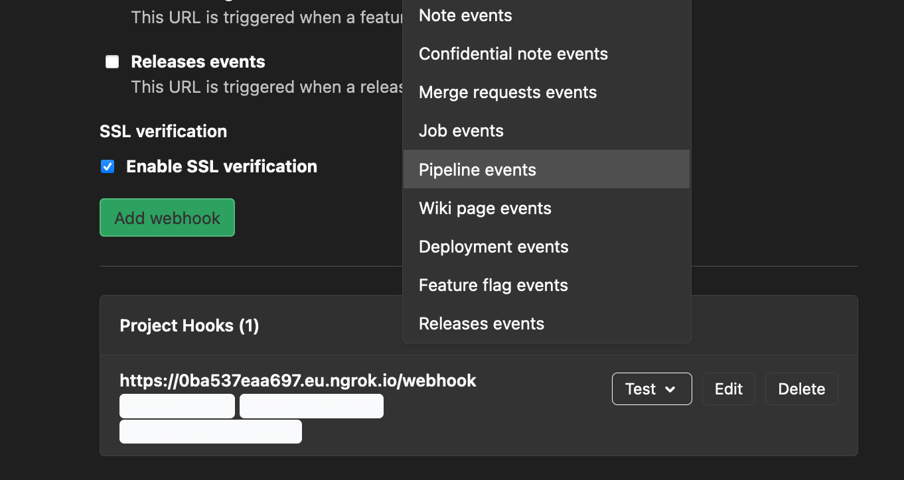

# Example usage of gitlab-ci-pipelines-exporter leveraging pipelines and jobs webhooks

This is a more advanced setup for users looking to reduce the amount of requests being made onto your GitLab API endpoint.

## Requirements

They include the ones from the [quickstart example](../quickstart/README.md):

- A personal access token on [gitlab.com](https://docs.gitlab.com/ee/user/profile/personal_access_tokens.html) (or your own instance) with `read_repository` scope
- [git](https://git-scm.com/) & [docker-compose](https://docs.docker.com/compose/)

For the specific usecase of webhooks, you will also need:
  
- GitLab [webhook configuration](https://docs.gitlab.com/ee/user/project/integrations/webhooks.html) privileges/capabilities on group(s) or project(s) you want to monitor.
- Connectivity from GitLab rails processes towards the exporter's http endpoint. If you don't because you want to try it from your laptop no worries, I cover this out in [this paragraph](#Obtain-network-connectivity-between-GitLab-and-the-exporter)

## 🚀

### Configure and start the exporter

```bash
# Clone this repository
~$ git clone https://github.com/mvisonneau/gitlab-ci-pipelines-exporter.git
~$ cd gitlab-ci-pipelines-exporter/examples/webhooks

# Provide your personal GitLab API access token (needs read_api permissions)
~$ sed -i 's/<your_token>/xXF_xxjV_xxyzxzz' gitlab-ci-pipelines-exporter/config.yml

# Configure a secret token for your webhooks authz
~$ export SECRET_TOKEN=$(openssl rand -base64 32)
~$ sed -i "s/<strong_arbitrary_secret_token>/${SECRET_TOKEN}" gitlab-ci-pipelines-exporter/config.yml

# Configure a project on which you are authorized to configure webhooks
~$ sed -i 's;<your_project_path_with_namespace>;my_group/my_project' gitlab-ci-pipelines-exporter/config.yml

# Start gitlab-ci-pipelines-exporter container
~$ docker-compose up -d
Creating network "webhooks_default" with driver "bridge"
Creating webhooks_gitlab-ci-pipelines-exporter-1 ... done
```

### Obtain network connectivity between GitLab and the exporter

You now need to configure the project (or the group it belongs to) to post webhooks to the exporter.

But first, you need connectivity from GitLab to the exporter endpoint.

In a **self-hosted scenario** is it likely that you will get native connectivity on your internal network loop.

If you are **using gitlab.com**, you will need to securely expose the exporter endpoint over the internet 🌍

As this example is presumably going to be attempted from a laptop onto gitlab.com, I will showcase how to easily get a non-secure access between the two leveraging the very great [inlets](https://github.com/inlets/inlets) solution from [Alex Ellis](https://twitter.com/alexellisuk) 💚. Of course, if you already have connectivity, you can skip this step.

### Inlets configuration

You will need a working account with any of these cloud providers:

- `AWS`
- `Azure`
- `Civo.com`
- `DigitalOcean`
- `GCP`
- `Hetzner`
- `Linode`
- `Packet`
- `Scaleway`
- `Vultr`

You will also need both [inlets](https://github.com/inlets/inlets#get-inlets) and [inletsctl](https://github.com/inlets/inletsctl#install-inletsctl) binaries

Once you are all set, create your "exit" endpoint:

```bash
# Example using DigitalOcean
~$ inletsctl create -p digitalocean -a <digital_ocean_token>
[..]
inlets OSS (2.7.4) exit-server summary:
  IP: 62.220.30.130
  Auth-token: yOujNvJ75vbZW3wmWfB2EkCobHlCI3wo4RZVRfkY5PaxVrKMSi1bUtm9rUwTTW6t

Command:
  export UPSTREAM=http://127.0.0.1:8000
  inlets client --remote "ws://62.220.30.130:8080" \
	--token "yOujNvJ75vbZW3wmWfB2EkCobHlCI3wo4RZVRfkY5PaxVrKMSi1bUtm9rUwTTW6t" \
	--upstream $UPSTREAM

## Wait a few seconds for the instance to boot and then copy-paste the command
~$ export UPSTREAM=http://127.0.0.1:8000
~$ inlets client --remote "ws://62.220.30.130:8080" \
--token "yOujNvJ75vbZW3wmWfB2EkCobHlCI3wo4RZVRfkY5PaxVrKMSi1bUtm9rUwTTW6t" \
--upstream $UPSTREAM

## Attempt to reach your exporter http endpoint from the public address
~$ curl -i http://62.220.30.130/health/ready
HTTP/1.1 200 OK
Content-Length: 3
Content-Type: application/json; charset=utf-8
Date: Fri, 09 Oct 2020 13:57:23 GMT

{}
```

gitlab.com should be able to reach http://62.220.30.130/webhook now! 🎉

### Configure GitLab group(s) or project(s)

I will showcase how to do it from the web UI but this can also be achieved using GitLab's API

```bash
# Retrieve your secret token configured for the exporter
~$ echo $SECRET_TOKEN
UYqDp5DvHLrtCnkfHA8aBPEkyKfgHjTGAWZRUD4olZU=
```

Go onto the project's configuration page and configure a new webhook using:

- **URL**: `http://62.220.30.130/webhook`
- **Secret Token**: `UYqDp5DvHLrtCnkfHA8aBPEkyKfgHjTGAWZRUD4olZU=`
- Untick `Push events` and tick `Pipeline events`
- Hit the `Add webhook` button


You can then trigger a manual test:



If the last pipeline which ran on your project is on a ref that is configured to be exported, you will see the following logs:

```bash
~$ docker-compose logs -f
[..]
DEBU[2020-10-09T15:03:49+01:00] webhook request         ip-address="127.0.0.1:62838" user-agent=
[..]
```

## Cleanup

```bash
# Delete the container
~$ docker-compose down
# Delete the inlets exit node
~$ docker-compose down
```
